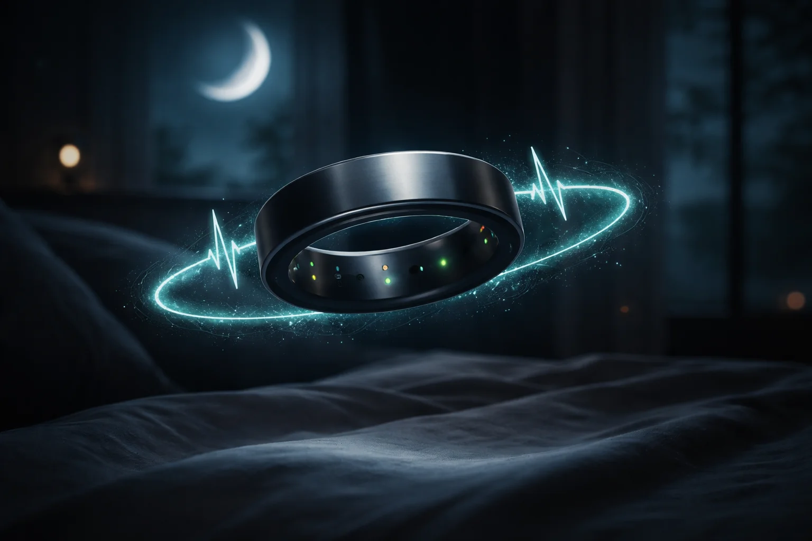

# Prompt de imagem — anel-inteligente-wearable-saude-2026

## Metáfora central
Um anel metálico escuro flutuando com um pulso de batimento cardíaco em teal girando ao redor dele, sobre uma cama à noite — o anel que monitora sono e coração.

## Prompt de geração (inglês)
A sleek dark titanium smart ring floating in mid-air above a softly lit bed at night, a glowing teal heartbeat waveform orbiting around the ring like a halo, tiny sensor lights glowing on the inner surface, a crescent moon visible through a window in the blurred background, calm atmosphere, cinematic lighting, dark background, high detail, 3:2 landscape, no text, no logos

## Alt-text (português)
Anel inteligente flutuando com linha de batimentos teal ao redor, quarto à noite — wearables de saúde em 2026

## Snippet HTML
```html

```
