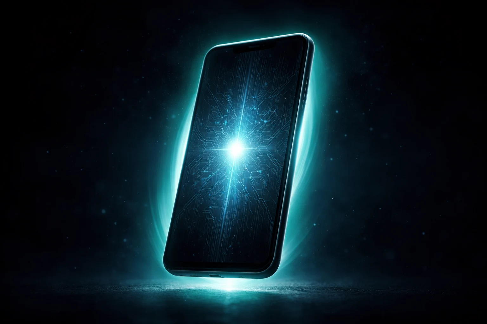

# Prompt de imagem — atualizacao-ia-android-setembro-2026

## Metáfora central
Um smartphone Android com uma camada dupla de brilho: uma camada externa acessível em teal suave cobrindo todo o aparelho, e um núcleo interno mais denso e brilhante, trancado atrás de um padrão de circuito mais complexo — representando os dois níveis de IA (Feature Drop de todos vs. Gemini Intelligence só para poucos).

## Prompt de geração (inglês)
A modern smartphone floating in darkness with two layers of glow: an outer soft teal aura wrapping the whole device, and a smaller, denser, brighter core of light glowing deep inside the screen behind a faint intricate circuit-like lattice pattern, as if the inner light is more exclusive and harder to reach, dark background, subtle floating particles, cinematic lighting, high detail, 3:2 landscape, no text, no logos

## Alt-text (português)
Celular com brilho duplo, uma camada externa acessível e um núcleo mais denso — ilustração dos dois níveis de IA no Android

## Snippet HTML (placeholder)
```html

```
