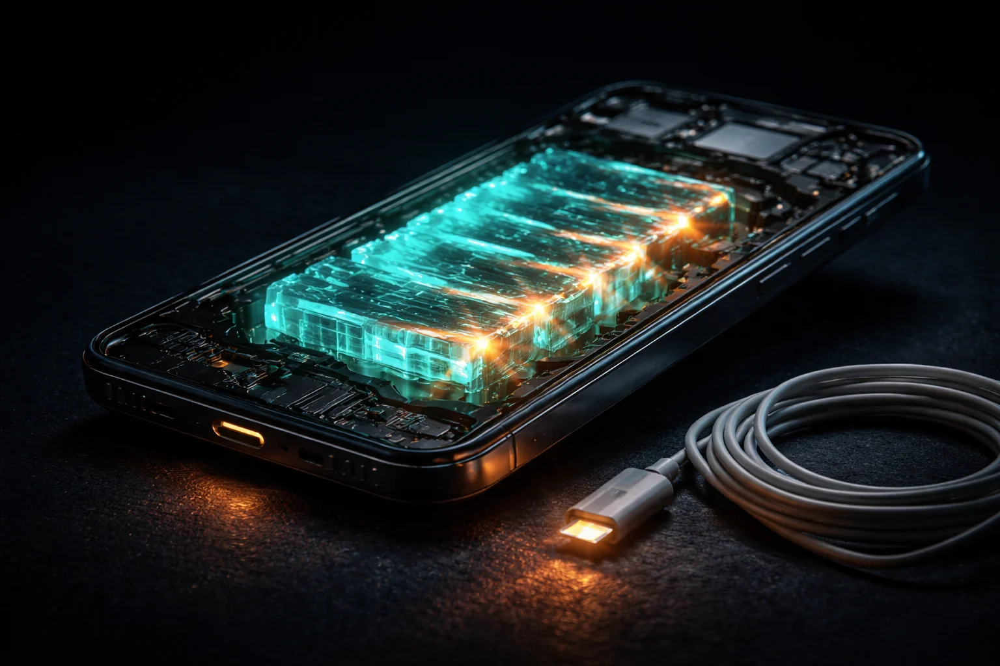

# Prompt de imagem — bateria-estado-solido-celular-2026

## Metáfora central
Um smartphone em corte transversal revelando uma bateria de camadas sólidas cristalinas brilhando, com um cabo de carregador partido caído ao lado — a guerra contra a tomada.

## Prompt de geração (inglês)
A cutaway view of a smartphone floating in darkness, its interior revealing a battery made of stacked translucent crystalline solid layers glowing teal from within, beside it an unplugged charging cable lying coiled on the ground with its connector dim, warm amber energy pulses flowing through the solid layers, cinematic lighting, dark background, high detail, 3:2 landscape, no text, no logos

## Alt-text (português)
Celular em corte mostrando bateria sólida cristalina brilhando e carregador desligado — bateria de estado sólido

## Snippet HTML
```html

```
