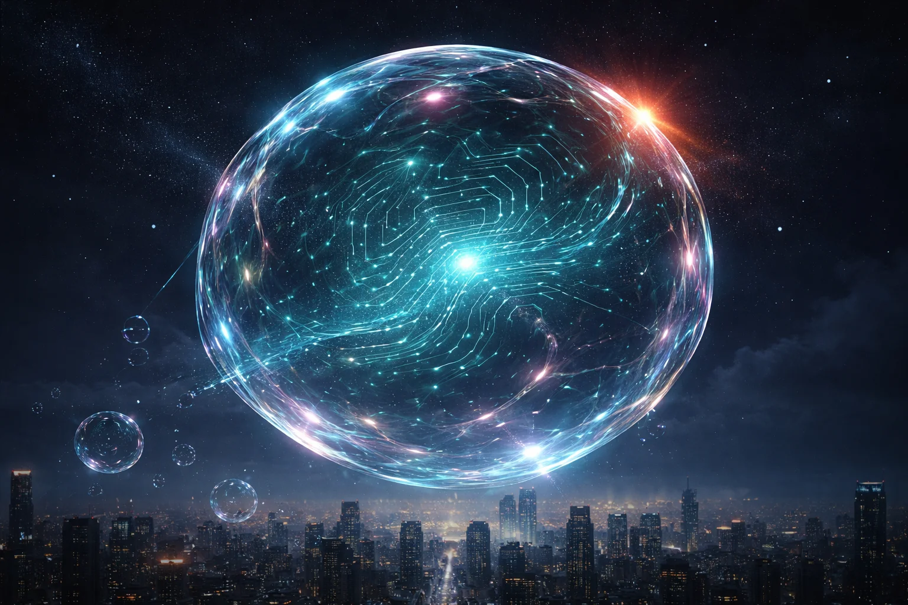

# Prompt de imagem — bolha-da-inteligencia-artificial-2026

## Metáfora central
Uma bolha de sabão gigante com padrão de circuito eletrônico brilhando por dentro, flutuando sobre uma skyline noturna e prestes a estourar — representa o crescimento acelerado (e frágil) das valuations de IA.

## Prompt de geração (inglês)
A giant translucent soap bubble with a glowing teal circuit-board pattern swirling inside its surface, floating high above a dark city skyline at night, the bubble's thin membrane rippling and straining as if about to pop, a faint orange warning glow reflected on one edge of the bubble, scattered smaller bubbles drifting below, starry night sky, cinematic lighting, dark background, high detail, 3:2 landscape, no text, no logos

## Alt-text (português)
Bolha de sabão com circuito eletrônico brilhante prestes a estourar sobre skyline noturna — ilustração sobre a bolha da inteligência artificial

## Snippet HTML
```html

```
