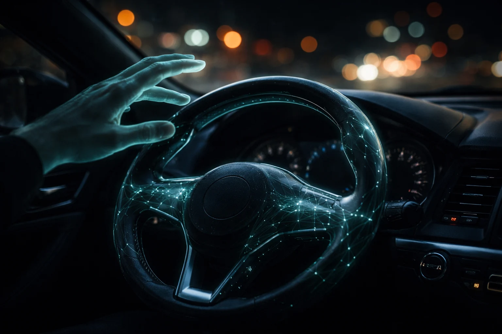

# Prompt de imagem — carro-autonomo-brasil-2026

## Metáfora central
Um volante de carro brilhando com padrão de rede neural e girando sozinho, enquanto uma mão humana translúcida paira acima sem tocá-lo — representa o carro que já dirige sozinho, mas a lei ainda exige mãos prontas no volante.

## Prompt de geração (inglês)
Close-up inside a dark car cabin at night, a steering wheel glowing with faint teal neural-network light patterns and turning on its own, a translucent ghostly human hand hovering just above the wheel without touching it, blurred city lights visible through the windshield beyond, soft dashboard glow, cinematic lighting, dark background, high detail, 3:2 landscape, no text, no logos

## Alt-text (português)
Volante de carro brilhando em teal e girando sozinho com uma mão fantasma pairando sem tocar — carro autônomo no Brasil

## Snippet HTML
```html

```
