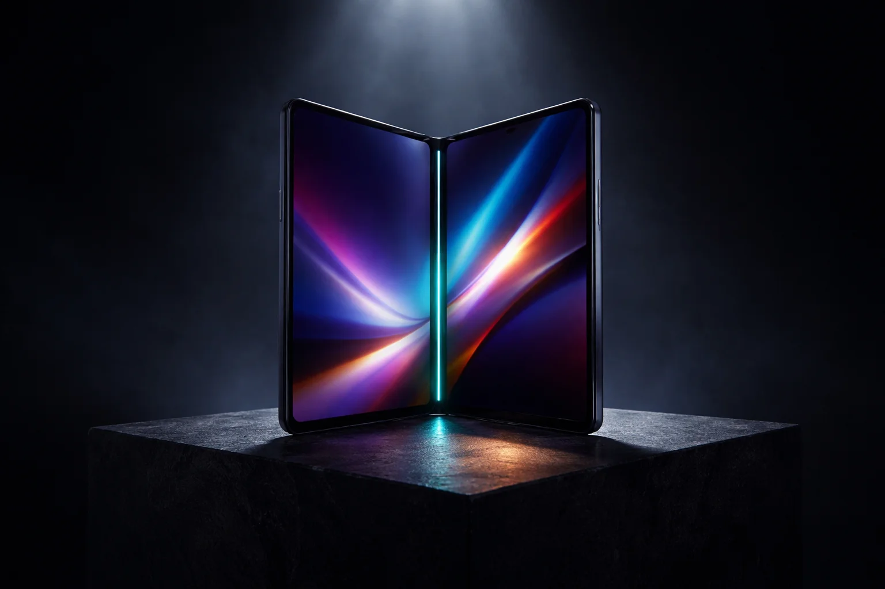

# Prompt de imagem — celular-dobravel-vale-a-pena-2026

## Metáfora central
Um celular dobrável meio aberto como um livro, com a dobradiça emitindo luz teal, sobre um pedestal como produto de vitrine — o foldable no centro da decisão.

## Prompt de geração (inglês)
A premium foldable smartphone standing half-open like a book on a dark stone pedestal, its central hinge glowing with a thin line of teal light, the inner display showing abstract colorful gradients, a faint amber price-tag-shaped glow reflected on the pedestal, dramatic spotlight from above, cinematic lighting, dark background, high detail, 3:2 landscape, no text, no logos

## Alt-text (português)
Celular dobrável meio aberto com dobradiça iluminada em teal sobre pedestal — vale a pena comprar foldable em 2026

## Snippet HTML
```html

```
