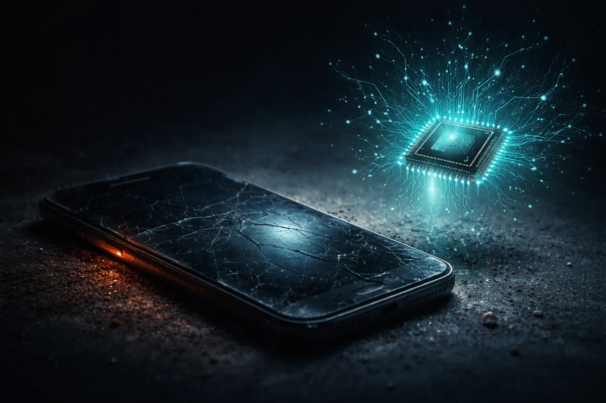

# Prompt de imagem — celular-obsoleto-ia-npu-2026

## Metáfora central
Um celular antigo empoeirado na sombra ao lado de um chip NPU brilhante em teal — o aparelho que ficou para trás por não ter IA.

## Prompt de geração (inglês)
An older smartphone lying on a dark surface covered in a light layer of dust, its screen cracked and dim, half in shadow, while beside it a small processor chip floats upward glowing intense teal with neural-network light traces branching out of it, faint orange glow on the old phone's edge suggesting decline, cinematic lighting, dark background, high detail, 3:2 landscape, no text, no logos

## Alt-text (português)
Celular antigo empoeirado na sombra ao lado de chip de IA brilhante — por que celulares ficam obsoletos com NPU

## Snippet HTML
```html

```
