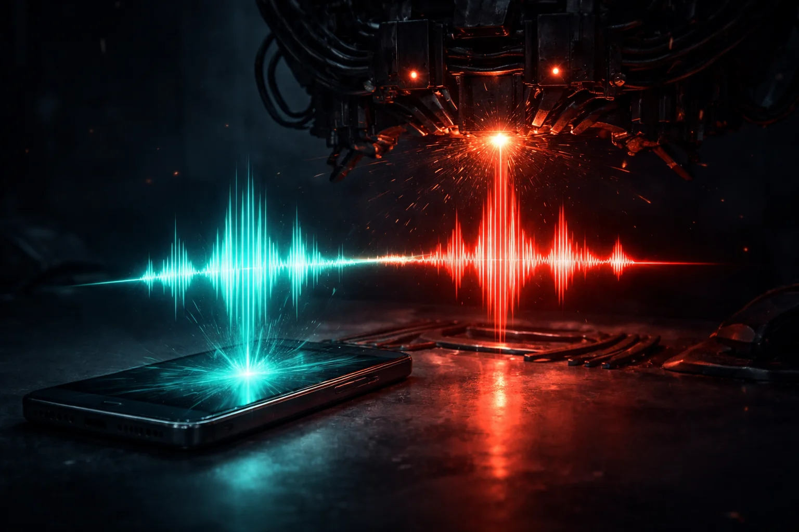

# Prompt de imagem — deepfake-voz-golpe-whatsapp-2026

## Metáfora central
Uma onda sonora em teal sendo copiada por uma máquina que a devolve em vermelho, saindo de um celular — a voz clonada usada no golpe.

## Prompt de geração (inglês)
A smartphone lying face-up on a dark table, a glowing teal audio waveform rising from its speaker, passing through a menacing mechanical duplicating device that outputs an identical waveform glowing red, sparks of orange light at the copying point, ominous shadows, cinematic lighting, dark background, high detail, 3:2 landscape, no text, no logos

## Alt-text (português)
Onda de voz teal sendo clonada e saindo vermelha do celular — golpe de deepfake de voz no WhatsApp

## Snippet HTML
```html

```
