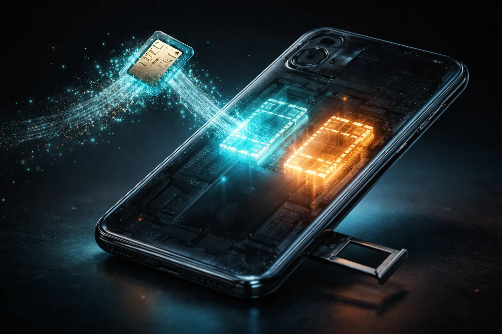

# Prompt de imagem — esim-como-funciona-brasil-2026

## Metáfora central
Um chip SIM físico se desfazendo em partículas que entram no celular e viram dois perfis de luz — o chip virtual com dois números.

## Prompt de geração (inglês)
A physical SIM card floating beside a smartphone, dissolving into streams of glowing teal particles that flow into the phone's body, inside the translucent phone two distinct holographic chip shapes glowing side by side, one teal and one amber, empty SIM tray pulled out and dim, cinematic lighting, dark background, high detail, 3:2 landscape, no text, no logos

## Alt-text (português)
Chip SIM físico virando partículas que entram no celular como dois chips virtuais — como funciona o eSIM

## Snippet HTML
```html

```
