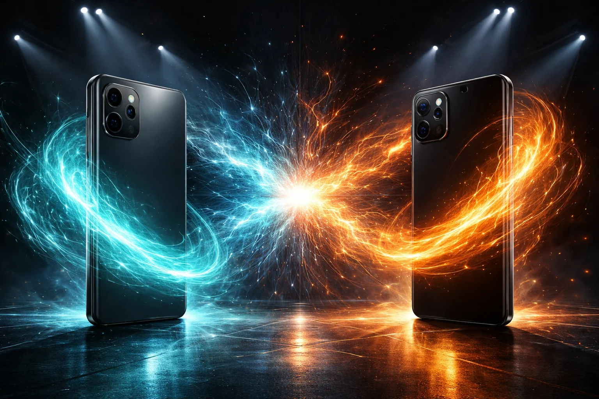

# Prompt de imagem — galaxy-ai-vs-apple-intelligence-2026

## Metáfora central
Dois celulares genéricos frente a frente numa arena, cada um projetando uma aura de IA de cor diferente que se choca no centro — o duelo das IAs.

## Prompt de geração (inglês)
Two unbranded premium smartphones standing upright facing each other on a dark arena floor, each projecting a swirling aura of AI energy, one teal and one amber, the two energies colliding in the center with bright sparks, spotlight beams from above, reflective floor, cinematic lighting, dark background, high detail, 3:2 landscape, no text, no logos

## Alt-text (português)
Dois celulares frente a frente com auras de IA se chocando — comparativo Galaxy AI vs Apple Intelligence

## Snippet HTML
```html

```
