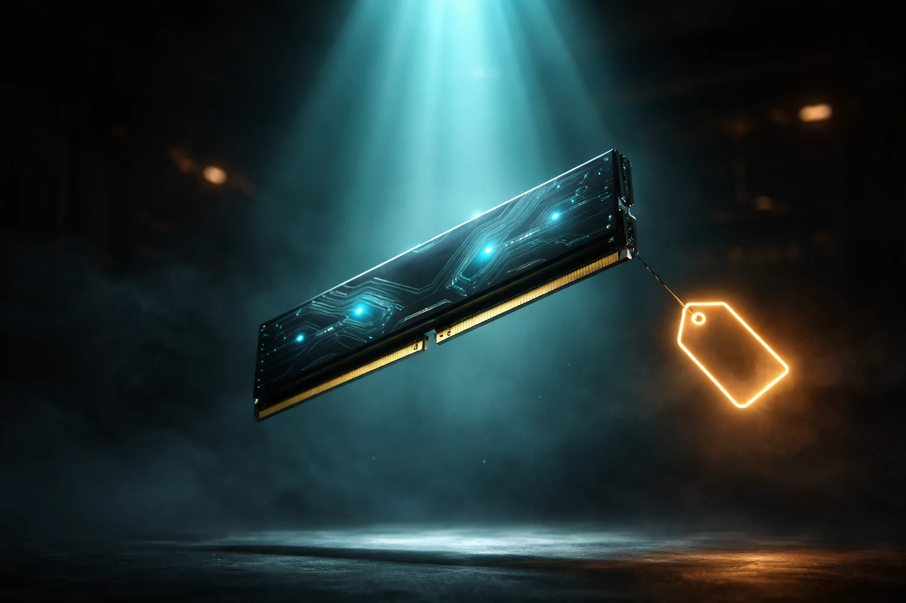

# Prompt de imagem — ram-cara-2026-por-que-notebook-pc

## Metáfora central
Um pente de memória RAM flutuando como um objeto precioso, iluminado por um feixe de luz teal vindo de cima — como se estivesse sob um holofote de leilão — comunicando que a memória virou item de luxo repentinamente.

## Prompt de geração (inglês)
A single DDR5 RAM memory stick floating and illuminated like a precious jewel under a dramatic teal spotlight beam coming from above, dark auction-house-like background with soft smoke, subtle glowing circuit patterns on the module, floating price tag glow in amber light nearby (no readable text), cinematic lighting, dark background, high detail, 3:2 landscape, no text, no logos

## Alt-text (português)
Pente de memória RAM iluminado como joia sob holofote — ilustração da crise de preços da RAM em 2026

## Snippet HTML (placeholder)
```html

```
