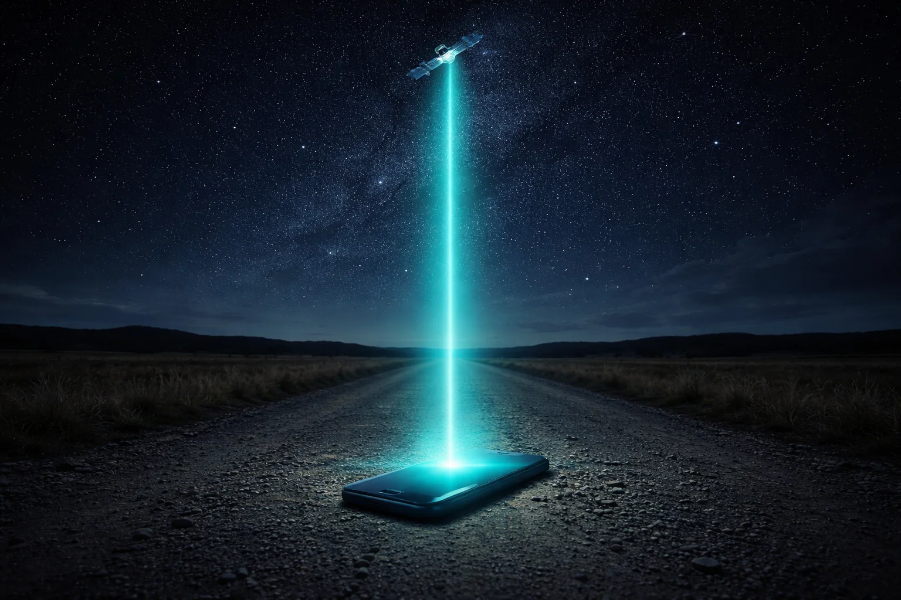

# Prompt de imagem — starlink-direto-no-celular-brasil-2026

## Metáfora central
Um celular sozinho numa estrada de terra isolada, emitindo um feixe de luz teal direto para um satélite no céu estrelado, sem nenhuma torre de celular à vista — representa a conexão direta ao satélite sem infraestrutura terrestre.

## Prompt de geração (inglês)
A single smartphone lying face-up on a dirt road in the middle of an empty rural landscape at night, a glowing teal beam of light rising straight up from the phone's screen into the starry sky, connecting to a small satellite visible in orbit above, no cell tower or building anywhere in the flat empty landscape, distant silhouettes of low hills, cinematic lighting, dark background, high detail, 3:2 landscape, no text, no logos

## Alt-text (português)
Celular sozinho numa estrada rural emitindo feixe de luz teal direto para um satélite no céu — como funciona o Starlink direto no celular no Brasil

## Snippet HTML
```html

```
