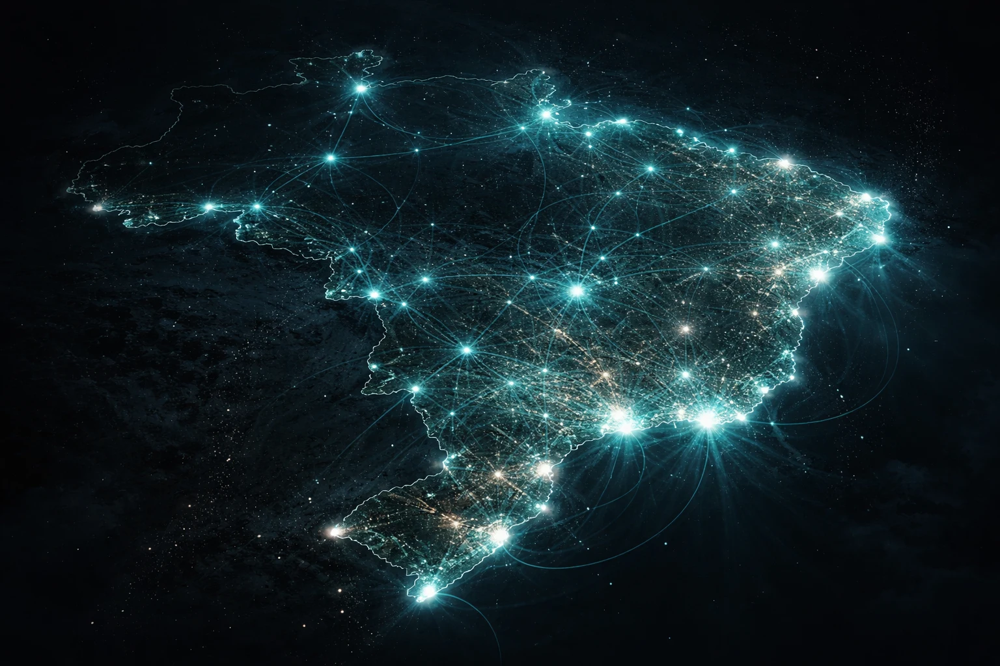

# Prompt de imagem — tecnologia-2027-o-que-muda-brasil

## Metáfora central
Um mapa do Brasil estilizado em silhueta escura, com pontos de luz teal se espalhando a partir das capitais em direção ao interior — como uma rede neural crescendo pelo território — representando a expansão desigual da tecnologia (IA, 5G, Pix) pelo país até 2027.

## Prompt de geração (inglês)
A dark stylized silhouette of Brazil's map seen from above at night, with glowing teal light nodes concentrated near the coastal capitals and thinner glowing neural-network-like lines slowly spreading toward the interior, some inland areas still dim and unconnected, subtle star-like particles in the sky, cinematic lighting, dark background, high detail, 3:2 landscape, no text, no logos

## Alt-text (português)
Mapa do Brasil com rede de luz teal se espalhando das capitais para o interior — ilustração da tecnologia chegando de forma desigual até 2027

## Snippet HTML (placeholder)
```html

```
