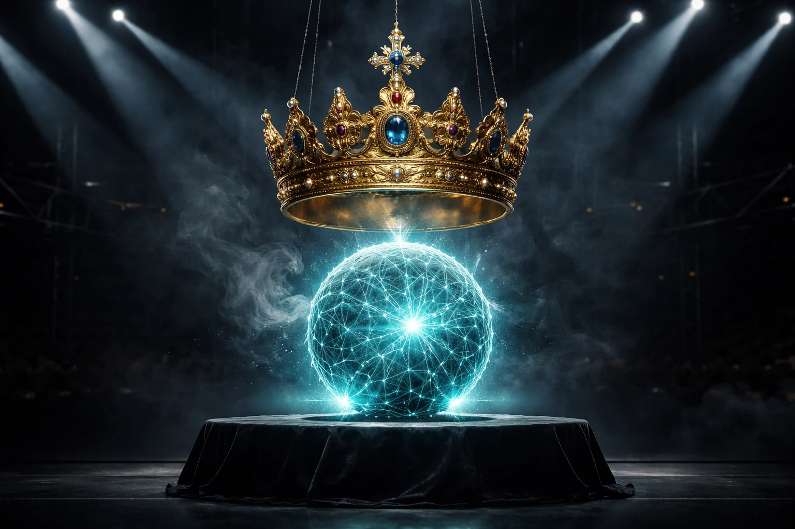

# Prompt de imagem — trump-superinteligencia-ia-czar-2026

## Metáfora central
Uma esfera de rede neural brilhante sendo coroada com uma coroa dourada grande demais para o seu tamanho, sobre um pedestal de palco iluminado — representa o rebranding político de "inteligência artificial" para "superinteligência" sem mudança técnica real.

## Prompt de geração (inglês)
A glowing teal neural-network orb resting on a dark stage pedestal, being lowered onto it is an ornate golden crown far too large and heavy for the orb's size, dramatic spotlight beams crossing above, thin chrome scaffolding barely visible in the background, dark empty auditorium behind, wisps of smoke catching the light, cinematic lighting, dark background, high detail, 3:2 landscape, no text, no logos

## Alt-text (português)
Esfera de rede neural recebendo uma coroa dourada grande demais para ela em um palco — Trump quer renomear inteligência artificial para "superinteligência"

## Snippet HTML
```html

```
